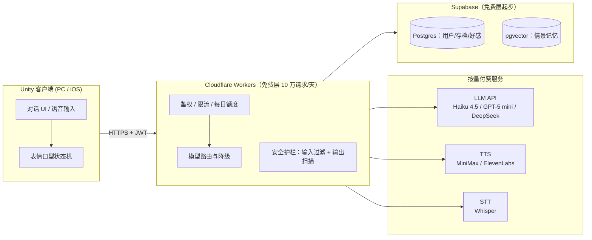

# 02 · AI 角色技术方案

> 目标：用最低的成本与最少的运维，实现"懂你、记得你的一切、有表情有声音"的 3D 角色。
> 所有价格截至 2026 年中，接入前复核官方价目页。

---

## 1. 总体架构



**铁律**：LLM/TTS 的 API key **绝不进客户端**（Steam/iOS 包体都可被解包，泄漏 = 别人刷爆你的账单）。客户端只持有用户 JWT，一切按量服务经 Workers 代理转发，代理侧做鉴权、每用户限流与每日额度。

---

## 2. 对话大脑

### 2.1 模型选型（$/百万 tokens，2026 年中）

| 模型 | 输入 | 输出 | 定位 |
|---|---|---|---|
| Claude Haiku 4.5 | $1.00（缓存读 ~$0.10） | $5.00 | **主力**：人设扮演稳、共情质量高 |
| GPT-5 mini | ~$0.25 | ~$2.00 | 备选/降级路由 |
| Gemini 2.5 Flash | ~$0.30 | ~$2.50 | 备选 |
| DeepSeek V3 | ~$0.27 | ~$1.10 | 成本兜底档 |
| Apple 端侧 ~3B（Foundation Models） | 免费 | 免费 | iOS 辅助：记忆提取、短寒暄、离线兜底 |

策略：**主力模型做"重要轮次"（情感浓度高、剧情节点），便宜模型做日常闲聊**，由代理层按会话状态路由；多供应商接口从第一天抽象好（平台风险预案，docs/06）。M0 阶段用盲测确定"最便宜的够用档"（docs/03 第 0 号验证）。

### 2.2 Prompt 分层（配合缓存，输入成本省 ~90%）

```
[缓存段（稳定，~2.5K tokens）]
  世界观与场景设定 / 小满人设卡（性格、说话风格、她的故事、边界）
  行为准则（红线 1/2/3、倾听模式规则）/ 安全规则 / 输出格式规范
[动态段（每轮变化，~1-1.5K tokens）]
  L0 核心画像（用户重要事实 JSON）
  检索到的情景记忆 top-k / 待跟进事件
  当前情境（时段/天气/地点/好感阶段/她的当前情绪）
  滚动会话摘要 + 最近 N 轮对话
[用户输入]
```

### 2.3 结构化输出（一次生成，驱动全身）

```json
{
  "reply": "……你上次说的那个面试，今天怎么样？",
  "emotion": "concerned",        // 12 种预设情绪 → 表情 blendshape 组
  "gesture": "lean_forward",     // 动作库标签 → 动画状态机
  "memory_write": [{"type": "event_followup_done", "key": "interview_0701"}],
  "safety": "none"               // none | boundary | crisis
}
```

---

## 3. 记忆系统（"记得你的一切"）

参照 Tolan 模式：**每轮重建上下文 = 人格卡 + 结构化画像 + 向量检索记忆**，而非无限拉长对话历史。

| 层 | 内容 | 存储 | 注入方式 |
|---|---|---|---|
| **L0 核心画像** | 名字、生日、职业、重要他人、现实目标、雷点偏好、**待跟进事件队列** | Postgres JSON | 每轮全量注入（~500 tokens） |
| **L1 情景记忆** | "值得记住的事"：每轮结束后由便宜模型异步提取 → 事实句 + 重要度评分 → embedding 入库 | pgvector | 按语义检索 top-5 注入 |
| **L2 会话摘要** | 滚动摘要（每 20 轮压缩一次） | Postgres | 每轮注入 |

- **写入管线**（异步，不阻塞回复）：对话轮 → 小模型提取（"用户明天面试" → `{type: followup, due: 明天}`）→ 去重合并 → 入库。重要度随时间衰减，高重要度（生日、创伤性话题的边界标记）不衰减。
- **主动关心的实现**：会话开始时检查"待跟进事件"，把到期事件注入动态段并提示"自然地提起"。黄昏信 = 每日一次的异步生成任务（取当日记忆 + 好感阶段 → 短信件），用 Batch API（-50%）跑，成本可忽略。
- **记忆册 UI**：直接读 L0+L1 给玩家看；玩家可修正（更新记录）或删除（物理删除 + 该条不再参与检索）——合规（GDPR/苹果）与玩法（信任感）同一套实现。
- 多角色预留：记忆表带 `character_id`，人设卡独立文件——二期加角色不动架构。

---

## 4. 语音

| 环节 | 首选 | 价格 | 备注 |
|---|---|---|---|
| TTS 日常档 | MiniMax Speech-02 | ~$0.05/1K 字符 | 中文表现力好、便宜，作默认 |
| TTS 品质档 | ElevenLabs | Creator $22/月起，API ~$0.10/1K 字符 | 预告片/关键剧情语音、英文主音色 |
| STT | OpenAI Whisper API | ~$0.006/分钟 | iOS 可用端侧听写兜底 |
| 实时语音通话 | OpenAI Realtime / Gemini Live | 音频入 ~$0.06/分、出 ~$0.24/分 | **v1 不做**：成本高一个数量级，列为订阅档远期卖点 |

要点：回复文本流式生成 → 按句切分逐句 TTS → 逐句播放（首音延迟目标 <2s）；常用短语（问候、语气词）预生成缓存；黄昏信默认不配音（点击朗读才合成，省成本）。

---

## 5. 表情、口型与动作（Unity）

- **面部标准**：角色模型统一 **ARKit 52 blendshapes**（MetaHuman / Character Creator 都能导出该标准）→ 表情资产可跨角色复用。
- **口型**：**uLipSync**（免费、开源，音频实时驱动，Job System 性能好）；预算宽裕再升级 SALSA（~$35，含眨眼/眼神模块）。
- **身体动画**：Mixamo 免费动画库打底（待机、走路、坐姿、手势 20 组起步）+ Unity Animation Rigging 做视线跟随（她看着你说话——恋与深空级"在场感"的最便宜实现）。
- **驱动**：LLM 输出的 `emotion/gesture` 标签 → Animator 状态机；情绪切换用 0.3–0.5s 混合过渡避免跳变。

---

## 6. 安全护栏（合规实现，对应 docs/01 §6 / docs/06）

```
用户输入 → [输入分类器] ──危机信号──→ 危机协议分支（共情模板+地区热线；本轮不入常规记忆；打危机日志）
              │──越界请求──→ 注入"人设化婉拒"指令 → 正常生成
              │──正常──→ 正常生成
LLM 输出 → [输出扫描：规则 + 分类器] → 不合规则重生成（最多 2 次）→ 仍不合规用安全兜底句
全链路 → 审计日志（采样存储，排查用）
```

- 输入分类器：首选平台 moderation 端点（如 OpenAI moderation 免费）+ 自维护中英关键词表双保险。
- **给 Steam AI 披露表的护栏描述**（docs/04 §5 直接引用）：系统提示约束 + 输入意图过滤 + 输出内容扫描与重生成 + 危机干预协议 + 审计日志。
- 每 3 小时休息提醒、AI 身份披露由客户端计时/首启流程实现（不依赖模型自觉）。

---

## 7. 成本模型与额度设计（本项目的生死线）

**假设**：日活重度用户，每天 20 轮对话；每轮输入 ~3.5K tokens（其中 ~2.5K 命中缓存）、输出 ~250 tokens；30% 轮次开语音（每轮回复 ~120 字）。

| 项 | 算式 | 月成本/重度用户 |
|---|---|---|
| LLM（Haiku 4.5） | 20 轮 × [缓存 2.5K×$0.1 + 新 1K×$1 + 出 0.25K×$5]/M × 30 天 | **~$1.6** |
| LLM（DeepSeek 档） | 同上按 $0.27/$1.10 | ~$0.45 |
| TTS（MiniMax） | 6 轮 × 120 字 × 30 天 × $0.05/1K | **~$1.1** |
| STT（Whisper） | 语音输入 5 分钟/天 | ~$0.9 |
| **合计** | 主力档全开 | **~$2.5–3.5/月**（纯文字轻用户 <$0.5） |

**结论与设计**（数据背书见 docs/00 §4.3——这是 LLM 游戏的头号死因）：
- 每用户**每日额度**制：Steam 买断含"基础额度"（如 60 轮文字/天 + 每日 10 分钟语音）；订阅解锁高额度。额度用"她今天有点忙"之类的世界观话术呈现，避免 Whispers 式生硬限时的差评。
- 代理层硬性熔断：单用户单日成本上限、全局日预算告警。
- 降本三板斧优先级：提高缓存命中 > 闲聊轮次路由到便宜模型 > 输出长度约束（短回复更像聊天，反而更真实）。

---

## 8. 后端与运维（一个人养得起）

| 组件 | 方案 | 成本 |
|---|---|---|
| API 代理/额度/路由 | Cloudflare Workers | 免费层 10 万请求/天，够到数千 DAU |
| 用户/存档/记忆 | Supabase（Postgres + pgvector + Auth） | 免费层起步；上线转 Pro $25/月 |
| 黄昏信等异步任务 | Workers Cron + LLM Batch API | 可忽略 |
| 崩溃/日志 | Sentry 免费层 + Workers 日志 | $0 |

100–1000 用户阶段平台固定成本 **$0–25/月**；真实支出是按量 LLM/TTS（§7 的额度设计就是为了让它与收入挂钩）。

---

## 9. M0 需要验证的技术问题清单（对应 docs/03）

1. 便宜档模型（DeepSeek/GPT-5 mini）扮演小满的质量是否可接受？（20 段对话盲测 vs Haiku）
2. 流式 LLM→分句 TTS→播放的首音延迟能否 <2s（国内网络环境 + 海外部署下分别测）？
3. 1000 轮模拟对话的实测成本 vs §7 估算（误差 >2 倍即触发方案降级）。
4. uLipSync 在 iOS 目标机型（iPhone 12 起）的帧率开销。
5. pgvector 检索 + Workers 往返延迟对总延迟的贡献。
